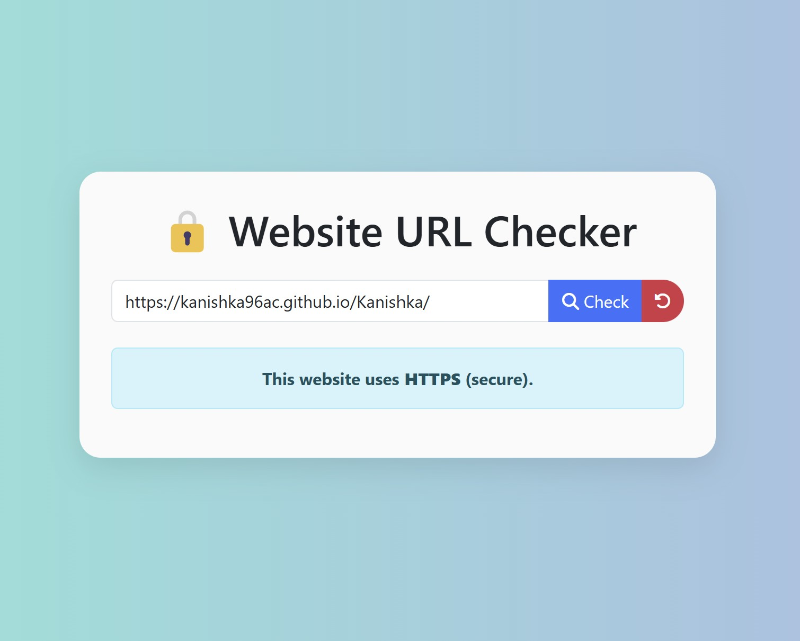

# 🔒 Website URL Security Checker

A simple Flask-based web application to check if a website is secure or not by analyzing its URL protocol (HTTP vs HTTPS). Built for beginners and learners to understand basic Flask app structure with Bootstrap styling.

## 📸 Demo

## 🚀 Features

- ✅ URL input with support for pressing Enter or clicking a button
- 🔍 Displays whether a website uses HTTPS (secure) or HTTP (not secure)
- 🎨 Beautiful and responsive UI with Bootstrap 5 and FontAwesome icons
- 🔁 Reset button to clear input and result
- 💾 Session management to maintain state
- 🔐 Secure `.env` configuration for secret keys

## 🛠 Technologies

- Python 3
- Flask
- Jinja2
- HTML5 / CSS3
- Bootstrap 5
- FontAwesome
- dotenv

## 🧑‍💻 How to Run Locally

1. **Clone the repository**

   git clone https://github.com/Kanishka96ac/Website-Checker.git

   cd Website-Checker

2. **Install dependencies**

   pip install -r requirements.txt

3. **Set up the .env file Create a .env file in the root folder:**

   SECRET_KEY=your_secret_key_here

4. **Run the Flask app**

   python app.py

5. **Open in your browser:**

   http://127.0.0.1:5000

## 📁 Project Structure

├── app.py
├── .env
├── requirements.txt
├── templates
│ └── index.html
├── static
│ └── css
│ └── styles.css

## 👨‍💻 Author

Made with ❤️ by Kanishka Peramunugama
